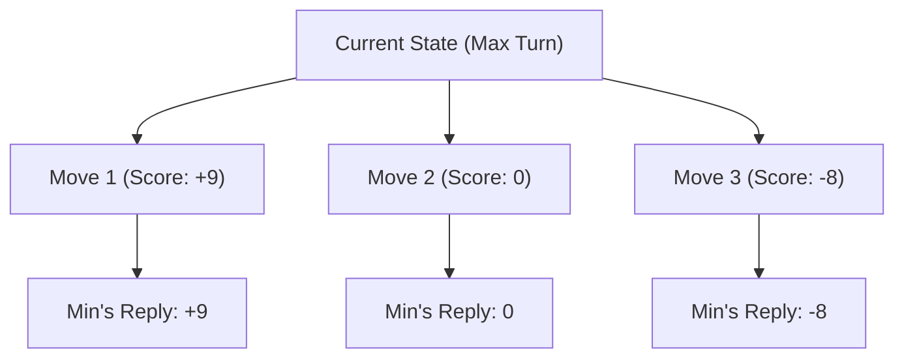

# 🧠 Tic-Tac-Toe AI Showcase & Lab

An educational, showcase-grade Tic-Tac-Toe application featuring an **unbeatable Minimax AI**, **Alpha-Beta pruning**, real-time **decision reasoning**, dynamic **move evaluation heatmaps**, and synthesized **Web Audio API** sound effects.

Built with **100% Vanilla Web Technologies (HTML5, CSS3, JavaScript)** with zero external libraries or build tools.

---

## 🌟 Highlights & Features

1. **Unbeatable Minimax AI Engine**:
   - Implements the Minimax decision algorithm with **Alpha-Beta Pruning**.
   - Depth-penalized evaluation: Favors fast wins ($+10 - \text{depth}$) and delays losses ($\text{depth} - 10$).
   - Mathematically proven: Against an optimal player, it always draws; against any blunder, it immediately seizes victory.

2. **Pedagogical AI Brain & Decision Reasoning**:
   - In every turn, the AI explains its strategic reasoning in plain English (e.g., *"Strategic Fork: Tile 3 creates 2 simultaneous winning threats"* or *"Positional Advantage: Captured the center tile to control 4 axes"*).
   - Displays real-time metrics: **Game states evaluated**, **Computation latency in ms**, and **Minimax evaluation score**.

3. **Real-Time Board Evaluation Heatmap**:
   - Toggle the heatmap button to overlay real-time evaluation scores on all open tiles:
     - 🟢 **Green (+Score)**: Winning / optimal move.
     - 🟡 **Yellow (0)**: Neutral / draw move.
     - 🔴 **Red (-Score)**: Suboptimal / losing blunder.

4. **Multiple Game Modes**:
   - **Human vs AI**: Play as ✕ (1st) or ○ (2nd) across 3 difficulty tiers:
     - *Mastermind (Unbeatable)*: Full Minimax search.
     - *Tactician (Medium)*: 1-move win/block detection with 60% optimal lookahead.
     - *Novice (Easy)*: Casual exploration.
   - **Two-Player Pass & Play**: Local offline multiplayer.
   - **AI vs AI Showcase**: Watch two AI engines compete with adjustable simulation speeds (0.5x, 1.0x, 2.5x).

5. **Audio Synthesizer (Zero External Assets)**:
   - Programmed with the browser's native **Web Audio API**.
   - Generates pure sine and triangle waveforms for crisp clicks, harmonic moves, victory fanfare, and draw tones.
   - Works 100% offline with zero missing audio files.

6. **Modern Cyber-Glassmorphism UI**:
   - Fluid responsive design with CSS Grid, custom properties, and backdrop blur.
   - Smooth animated SVG mark drawings for ✕ and ○.
   - Dynamic SVG winning strike line calculation that aligns across any screen resolution.
   - Confetti particle explosion canvas on game wins.
   - Full keyboard navigation: Press keys `1` through `9` to make moves!

---

## 📐 How the AI Works (For Students)

### 1. The Minimax Algorithm
Minimax is a recursive backtracking algorithm used in decision theory and game theory. In a zero-sum two-player turn-based game, one player seeks to maximize the score (**Maximizer**) while the opponent seeks to minimize it (**Minimizer**).



### 2. The Evaluation Function
At each terminal node (leaf) of the game tree:
- If AI wins: $\text{Score} = +10 - \text{depth}$ (rewards early wins).
- If Opponent wins: $\text{Score} = \text{depth} - 10$ (rewards fighting back and delaying defeat).
- If Draw: $\text{Score} = 0$.

### 3. Alpha-Beta Pruning
Tic-Tac-Toe has up to $9! = 362,880$ game states. Alpha-Beta pruning maintains two bounds during tree traversal:
- $\alpha$: The maximum score that the maximizing player is assured of so far.
- $\beta$: The minimum score that the minimizing player is assured of so far.

Whenever $\beta \le \alpha$, the remaining child nodes are pruned, drastically reducing computation latency without sacrificing optimality.

---

## 📁 File Structure

All files reside in this single folder:

```
TicTacToe/
├── index.html       # Semantic layout, scoreboard, controls, and accessibility
├── style.css        # Glassmorphic dark theme, CSS variables, animations
├── game.js          # Pure state machine, move validation, win detection & stats
├── ai.js            # Minimax algorithm, Alpha-Beta pruning, reasoning & heatmap
├── audio.js         # Zero-dependency Web Audio API synthesizer
├── app.js           # DOM controller, keyboard handlers, confetti & SVG strike
├── tests.html       # Interactive in-browser unit test suite
├── test_runner.py   # Python test suite simulating 320+ games (0 losses)
└── README.md        # Documentation and pedagogical guide
```

---

## 🚀 How to Run

### Method 1: Direct File Opening
Double-click `index.html` to launch directly in any modern web browser (Chrome, Safari, Firefox, Edge).

### Method 2: Local HTTP Server
Using Python's built-in web server:
```bash
python3 -m http.server 8080
```
Then visit [http://localhost:8080](http://localhost:8080) in your browser.

---

## 🧪 Automated Testing

### In-Browser Test Suite
Open [`tests.html`](file:///Users/suryavashistta/Documents/GitHub/TicTacToe/tests.html) in your browser to inspect interactive unit test results for game state, win detection, undo moves, and threat blocking.

### Python Simulation Test Suite
Run the automated test runner in your terminal:
```bash
python3 test_runner.py
```

**Verification Results**:
- 150 Games: Minimax (✕) vs Random Player (○) $\rightarrow$ **147 Wins, 0 Losses, 3 Draws**
- 150 Games: Minimax (○) vs Random Player (✕) $\rightarrow$ **123 Wins, 0 Losses, 27 Draws**
- 20 Games: Minimax (✕) vs Minimax (○) $\rightarrow$ **20 Draws (100% Equilibrium)**
- Total Losses: **0** (Mathematically Unbeatable)

---

## 🎓 Classroom Discussion Prompts for Students
1. **Branching Factor**: Why is full Minimax practical for Tic-Tac-Toe ($3 \times 3$), but requires heuristic approximations (like Monte Carlo Tree Search or Deep Neural Networks) for Chess or Go?
2. **First-Player Advantage**: Does Player ✕ have an inherent statistical advantage when playing against a random player compared to Player ○? (See simulation numbers: 147 wins as ✕ vs 123 wins as ○).
3. **Forks vs Blocks**: Why is creating a "fork" (2 distinct winning lines) an automatic winning move in Tic-Tac-Toe?
